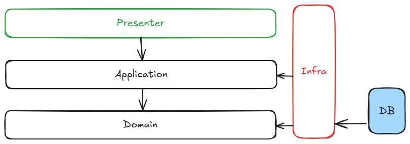
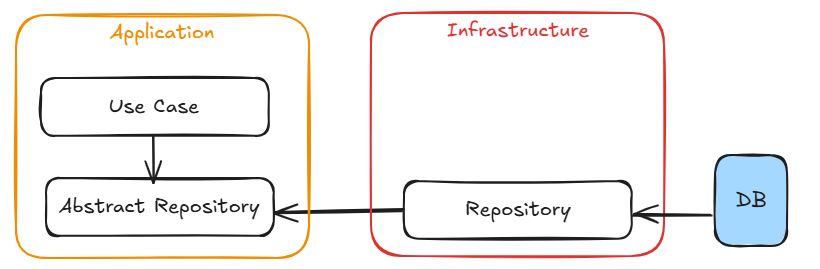

# python-clean-model

> Status: Developing ⚠️

## RESUME
This is a model for Python/Flask projects using a mix of Clean Architecture and Hexagonal Architecture concepts. However, the use of complex architectures is not a consensus in the Python community. The present project is a personal exercise in adapting these architectures to Python’s reality. For this purpose, I incorporated the main concepts (though not all) to create a structure that fits this goal well.

## ARCHITECTURE
The main structure is represented in the follow figure:

The Presenter layer is responsible for:
- Receiving user requests.
- Providing a communication interface to the client side.

The Presenter layer calls the Use Case (from the Application layer). Each Use Case handles a single task. Note that business logic should reside in the Domain Layer using the Rich Entity approach.

To persist entity data, the Application layer uses Ports (abstract methods) to adhere to the Dependency Inversion Principle (DIP). The concrete implementation is stored in the Infrastructure layer.

Dependency injection (using the `inject` library) simplifies this process:

## FUTURE IMPROVEMENTS
Many enhancements are still needed, such as:
- Input data sanitization.
- Implementing the Unit of Work pattern.
- Adding domain-specific exceptions.
- Other best practices.

Contributions are welcome! Feel free to collaborate on this idea.

